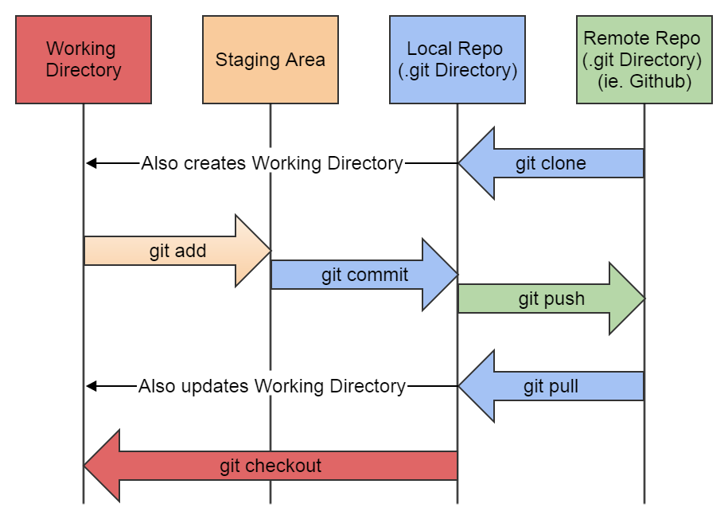

# Taller de introducción a `git` y GitHub

En este taller de introducción a `git` y [GitHub][1] aprenderemos los comandos básicos para empezar a trabajar con repositorios de forma local y remota.

# `git`

## Instalación y configuración de `git`

### Instalación de `git`

#### Derivados de Debian, como Ubuntu, Linux Mint, Deepin, AntiX, MX Linux

```
sudo apt-get update
sudo apt-get install git
```

#### Windows

Descargar desde la web oficial: https://git-scm.com/downloads

### Configuración de `git`

Configuramos el nombre y el email que aparecerán en los *commits* que hagamos sobre los repositorios.

```
git config --global user.name "Nombre"
```

```
git config --global user.email "correo@electronico.com"
```

Para comprobar si se han aplicado los cambios podemos ejecutar el siguiente comando para mostrar cuál es la configuración actual de `git`:

```
git config --list
```

## Secciones principales de un repositorio `git`

En un repositorio `git` podemos diferenciar las siguientes secciones:

* *Workspace*
* *Staging area (Index)*
* *Local repository*
* *Remote repository*



## Estados de un archivo en `git`

Un archivo puede estar en alguno de los siguientes estados:

* Sin seguimiento (*untracked*)
* Preparado (*staged*)
* Modificado (*modified*)
* Confirmado (*commited*)

El siguiente diagrama muestra en qué sección se puede encontrar cada archivo en función de su estado.

```
+-------------+  +-------------+  +-------------+
|  Workspace  |  |   Staging   |  |    Local    |
|             |  |     Area    |  |  Repository |
+------+------+  +------+------+  +------+------+
       |                |                |
       |                |                |
   Untracked            |                |
       |                |                |
   Modified          Staged          Commited
       |                |                |
       |                |                |
       |                |                |
       +                +                +
```

Para consultar el estado de los archivos usamos el comando:

```
git status
```

**Este comando es muy usado** ya que es fundamental conocer el estado de los archivos de nuestro repositorio.

## Cómo trabajar con un repositorio local

### Creación de un repositorio local

Un repositorio Git es un directorio oculto llamado `.git` que se guarda en el directorio raíz de nuestro proyecto. El directorio `.git` almacena el historial de todos los cambios que se han realizado.

El comando para crear un repositorio `git` es el siguiente:

```
git init
```

Por ejemplo, para crear nuestro primer repositorio podríamos hacer lo siguiente:

```
mkdir taller-git
cd taller-git
git init
```

Si examinamos el contenido del directorio `.git` veremos el siguiente árbol de contenidos:

```
.
└── .git
    ├── HEAD
    ├── config
    ├── description
    ├── hooks
    │   ├── applypatch-msg.sample
    │   ├── commit-msg.sample
    │   ├── post-update.sample
    │   ├── pre-applypatch.sample
    │   ├── pre-commit.sample
    │   ├── pre-push.sample
    │   ├── pre-rebase.sample
    │   ├── pre-receive.sample
    │   ├── prepare-commit-msg.sample
    │   └── update.sample
    ├── info
    │   └── exclude
    ├── objects
    │   ├── info
    │   └── pack
    └── refs
        ├── heads
        └── tags
```
